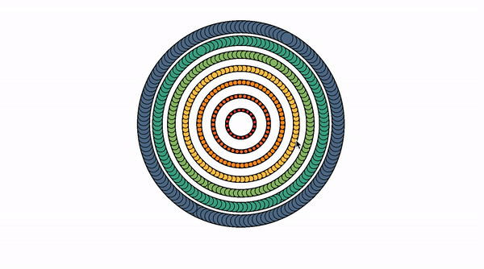

# faun-lore
Some off thoughts of using non-invasive fNIRS measurements in a radial heart in a type of spiritual waiting room of a groups cognition aggregate

the radial representation represent the bins of frequencies, with the scaled frequencies radiating out from the center, and the sound is type of 'fax' dial up for the groups connection

vibrations on a string become looking a lot more like cash-in-transit gateways for windowed particles, where status equates to a repair on investment metric, where identity is represented by urbit identities, and the data particles are flung across the fluence network

in this version of a fluent-pad fork I removed the in-memory history, because I was experiencing node error on limit hits, what’s left is the user list

Thinking of Ohm reduction limits via CID particles when measuring eletromotive forces of carbon lifeforms, with stored energy via optimal flow state for modal state transition

attaching data feeds to the supply chain of trees, where cognitive threads become coil like spirit totems for informational decentralized compression resistance using curatorial mechanisms of like-frequencies. 

## integrations & software distribution
experimenting with the idea of distributing a dapp on urbit with the 2 networks integrated. 

Q: why is this a bad idea? network of urbit & the network of fluence coming together as a way to not clog a network of data packets, while also keeping the fundamentals of a p2p network in check.

bands of frequency from brain computer interface data can be assigned fractional NFT, which can be integrated in a timely ritual POAP using %gora.

